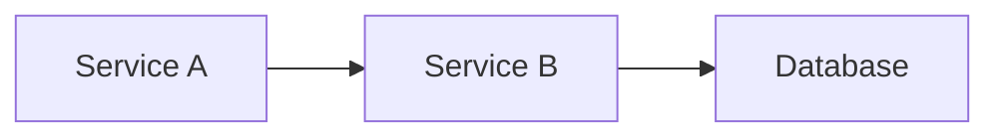

# remarkable-spec

Python library and CLI for the [reMarkable Paper Pro](https://remarkable.com/) tablet. Parses v6 `.rm` binary files, renders handwritten pages with full pen physics, runs OCR, extracts Mermaid diagrams, and syncs over USB/SSH.

Built for AI assistants. remarkable-spec is designed to be driven by terminal-based AI coding agents like [Claude Code](https://docs.anthropic.com/en/docs/claude-code), Codex CLI, and similar tools that operate through Bash. The CLI surface, structured output (`--json`), and OCR pipeline (which calls Opus 4.6 via Bedrock) assume a powerful LLM is orchestrating the commands and interpreting the results.

## Tested On

- **macOS Tahoe** (15.x) on Apple Silicon (M5)
- **reMarkable Paper Pro** (1620x2160 @ 229 DPI, 14 pen colors)

Other reMarkable models (reMarkable 2) and platforms are untested. Screen detection is automatic from stroke coordinate extents, so reMarkable 2 may work but is not verified.

## Features

| Feature | Description |
|---------|-------------|
| **Sync** | Incremental two-way sync over USB/SSH |
| **Render** | Handwritten pages → SVG, PNG, PDF — with PDF background compositing |
| **OCR** | Apple Vision + Textract → Opus 4.6 merge (extended thinking) |
| **Annotations** | Read handwritten annotations on pushed PDFs as structured text |
| **Diagrams** | Extract Mermaid from handwritten drawings |
| **Push** | Send PDFs, Markdown (with Mermaid auto-rendering and image embedding), Mermaid, text to device |

## Quick Start

```bash
uv add remarkable-spec
uv sync --all-extras

# Set your local xochitl data directory
export RMSPEC_XOCHITL=~/remarkable-backup/xochitl

# Sync from device
rmspec sync pull

# Render a document (auto-detects PDF backgrounds + Paper Pro screen)
rmspec render "My Notes" ./output/
rmspec render "Annotated PDF" page1.png --page 1

# OCR with PDF background compositing
rmspec ocr "My Notes" --page 3

# Read annotations on a pushed PDF
rmspec annotations "Design Review"

# Extract Mermaid diagrams
rmspec diagram "Architecture" --page 1 --render output.png
```

## AI Assistant Workflow

The primary use case: an AI agent pushes a document to the tablet, the user annotates with a pen, the agent reads the annotations back and applies them to the source file.

```bash
# Agent pushes a markdown doc (Mermaid diagrams render automatically)
rmspec sync proposal.md --folder "Projects"

# User annotates on the tablet (cross out, write notes, draw arrows)

# Agent pulls and reads annotations
rmspec sync pull
rmspec annotations "proposal"
# → Page 1: Crossed out "Phase 2" in "Timeline"
# → Page 5: Handwritten note "Assign to Charlie" next to item 5
# → Page 7: Changed task owner from Alice to Eve

# Agent updates the source file and re-pushes
rmspec sync push proposal.md --folder "Projects" --name "proposal v2"
```

### Markdown Push with Diagrams

When pushing `.md` files, the pipeline automatically:
1. Renders ` ```mermaid ` code blocks to inline PNGs via `mmdc`
2. Resolves image paths (relative and absolute) to base64 data URIs
3. Converts to PDF via WeasyPrint with e-ink-optimized styling

```markdown
## Architecture




```

Both the diagram and the image render in the PDF on the reMarkable.

## PDF Background Compositing

PDF-backed documents on the reMarkable store the original PDF alongside `.rm` annotation overlays. remarkable-spec automatically detects PDF-backed documents, rasterizes the PDF page via [PyMuPDF](https://pymupdf.readthedocs.io/), and composites it beneath the handwritten strokes. This means:

- **Render** shows printed text with handwritten annotations on top
- **OCR** captures both printed and handwritten content in one pass
- **Annotations** identifies cross-outs, additions, and corrections by comparing strokes against the original PDF text
- **Diagrams** see the full context when extracting Mermaid syntax

Use `--no-pdf-bg` to render strokes only (white background).

## Screen Auto-Detection

Automatically detects reMarkable 2 vs Paper Pro from stroke coordinate extents — no manual configuration needed.

## Architecture

```
src/remarkable_spec/
├── models/         # Pydantic v2: stroke, page, document, color, pen, screen
├── formats/        # Parsers: rm_file.py (rmscene), metadata, content, pagedata
├── render/         # SVG renderer, pen physics (10 types), palette, PDF backgrounds
├── ocr/            # pipeline.py, vision.py, textract.py, postprocess.py, diagram.py
├── device/         # connection.py (SSH), web_api.py (HTTP), sync.py, push.py
├── sync/           # SQLite DB, models, hasher, migrations
├── export/         # svg.py, png.py, pdf.py
└── cli/            # cyclopts commands
```

## Dependencies

**Core:** pydantic, rmscene, cyclopts, rich, pydantic-settings, pymupdf

**Optional extras:**
- `[render]` — cairocffi, cairosvg, pillow (PNG/PDF export)
- `[device]` — paramiko, httpx (SSH/HTTP device access)
- `[ocr]` — pyobjc (Apple Vision framework)
- `[push]` — weasyprint, markdown (Markdown→PDF conversion with Mermaid and image embedding)
- `[aws]` — boto3 (Textract, Bedrock for OCR and annotations)

**External tools (optional):**
- `mmdc` (mermaid-cli) — for Mermaid diagram rendering in pushed Markdown and diagram extraction validation
- `cairo` — for PNG/PDF export (auto-detected at `/opt/homebrew/lib` on macOS)

## Development

```bash
uv sync --all-extras
uvx ruff check src/ --fix && uvx ruff format src/
uvx ty check src/
```

## License

MIT
