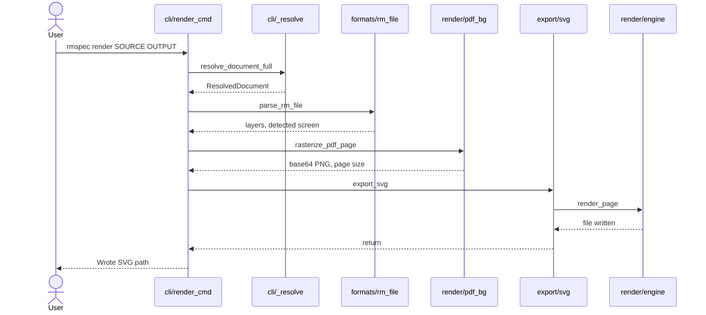
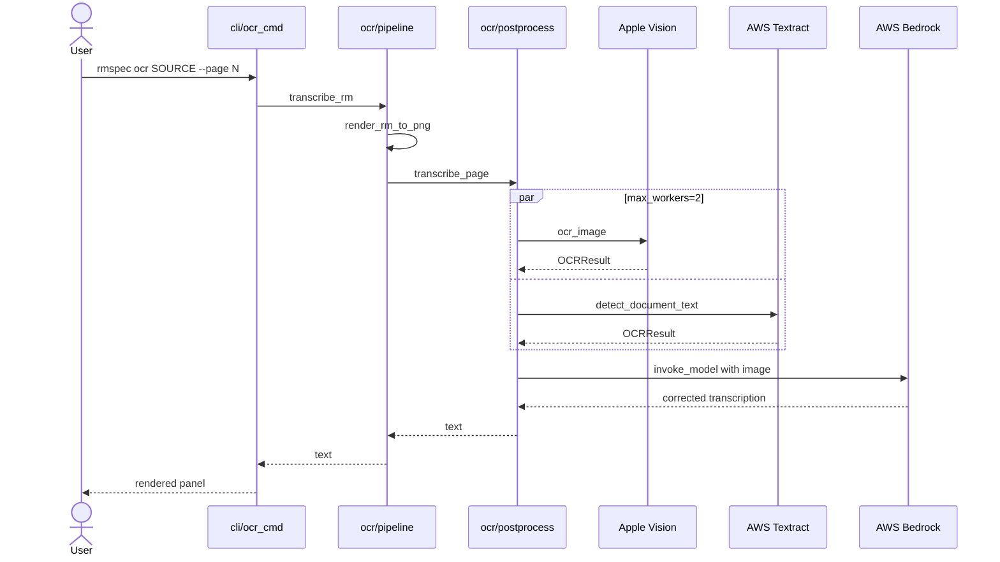
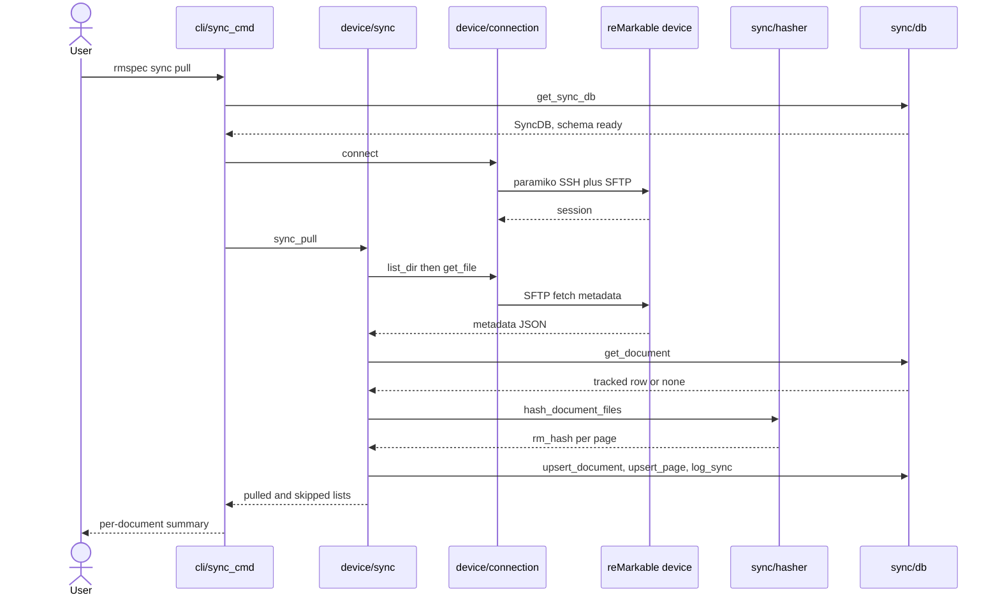

# remarkable-spec · Data flow

Every flow in this system begins with the same external event: a shell invocation of the `rmspec`
console script, declared as the distribution's only entry point at `pyproject.toml:21` and resolving
to the `cyclopts.App` built at `src/remarkable_spec/cli/__init__.py:40`. There is no HTTP server, no
queue consumer, and no scheduler, so "request lifecycle" here means "CLI subcommand lifecycle".
Eleven top-level commands are mounted in one contiguous block whose first call sits at
`src/remarkable_spec/cli/__init__.py:48`. The three walked below traverse the widest span of the
module graph: flow 1 is the local render substrate, flow 2 layers external OCR services on top of it,
and flow 3 is the only flow that crosses a network boundary to the tablet and writes persistent state.

## Flow 1: render a document to SVG, PNG, or PDF

1. `rmspec render <source> <output>` dispatches to the cyclopts `@app.default` function `render`,
   which branches on whether `source` ends in `.rm` — `src/remarkable_spec/cli/render_cmd.py:58`,
   `:112`.
2. A document name rather than a file path routes to `_render_document_by_name`, which resolves the
   local xochitl mirror directory from the `--xochitl` flag, then `RMSPEC_XOCHITL`, then
   `~/.remarkable-spec/xochitl` — `src/remarkable_spec/cli/render_cmd.py:176` and
   `src/remarkable_spec/cli/_util.py:85`.
3. `resolve_document_full` scans every `*.metadata` file in the mirror and matches full UUID, then
   UUID prefix, then case-insensitive name substring; on duplicates it keeps the candidate with the
   most pages, then the newest `lastModified` — `src/remarkable_spec/cli/_resolve.py:234`, `:54`,
   `:134`.
4. Each page's `.rm` file goes to `parse_rm_file`, which reads the bytes and hands them to
   `rmscene.read_tree`, converting the returned scene tree into `Layer`, `Stroke`, and `Point` models
   — `src/remarkable_spec/formats/rm_file.py:46`, `:83`, `:92`.
5. `detect_screen` selects the Paper Pro spec over reMarkable 2 as soon as any stroke point exceeds
   RM2 bounds, accounting for the v6 center-origin X axis — `src/remarkable_spec/models/screen.py:86`,
   `:102`.
6. For a PDF-backed document, `_get_pdf_bg` maps the page through the `redir` index and rasterizes
   that PDF page to a base64 PNG via `rasterize_pdf_page` — `src/remarkable_spec/cli/render_cmd.py:313`
   and `src/remarkable_spec/render/pdf_bg.py:15`.
7. `_export_page` dispatches on the output suffix to `export_svg`, `export_png`, or `export_pdf`, the
   last two wrapped so a missing `[render]` extra exits with an install hint —
   `src/remarkable_spec/cli/render_cmd.py:340`, `:384`.
8. `export_svg` constructs an `SVGRenderer` and calls `render_page`, which applies `x_shift = vw / 2`
   to compensate for the center-origin X axis, emits one `<line>` element per stroke segment, and
   writes the file — `src/remarkable_spec/export/svg.py:58` and
   `src/remarkable_spec/render/engine.py:134`, `:230`.

## Flow 2: OCR a page through dual engines and an LLM merge

1. `rmspec ocr <source>` dispatches to the `@app.default` function `ocr`, which lazily imports
   `transcribe_rm` so the `[ocr]` and `[render]` extras are not required at CLI startup —
   `src/remarkable_spec/cli/ocr_cmd.py:50`, `:86`.
2. The document resolves through the same shared helper flow 1 uses; page selection defaults to the
   last page unless `--page` or `--all` is passed — `src/remarkable_spec/cli/ocr_cmd.py:114`, `:132`.
3. `transcribe_rm` runs the whole pipeline inside a temporary directory, with the Bedrock model ID
   defaulting to the hardcoded literal `global.anthropic.claude-opus-4-6-v1` —
   `src/remarkable_spec/ocr/pipeline.py:86`, `:90`, `:113`.
4. `render_rm_to_png` reuses flow 1's parse and SVG export, rasterizes with `cairosvg.svg2png` at the
   requested DPI, and deletes the intermediate SVG — `src/remarkable_spec/ocr/pipeline.py:25`, `:75`,
   `:82`.
5. `transcribe_page` holds the only concurrency in the codebase: a `ThreadPoolExecutor(max_workers=2)`
   submits Apple Vision and AWS Textract against the same PNG and joins both futures —
   `src/remarkable_spec/ocr/postprocess.py:110`, `:131`, `:135`.
6. `ocr_image` drives Apple Vision's `VNRecognizeTextRequest` at accurate recognition level, while
   `ocr_image_textract` calls Textract `detect_document_text` and averages per-line confidence —
   `src/remarkable_spec/ocr/vision.py:89` and `src/remarkable_spec/ocr/textract.py:40`, `:69`.
7. `merge_with_image` base64-encodes the rendered PNG and interpolates both OCR transcripts into
   `PIPELINE_PROMPT`, which instructs the model to treat the image as ground truth —
   `src/remarkable_spec/ocr/postprocess.py:148`, `:171`, `:173`.
8. `_invoke_bedrock_vision` posts a raw `anthropic_version: "bedrock-2023-05-31"` body through
   `client.invoke_model` with extended thinking enabled, then returns the last text block of the
   response — `src/remarkable_spec/ocr/postprocess.py:187`, `:228`, `:232`.

## Flow 3: incremental pull from the device

1. `rmspec sync pull` dispatches to the `pull` subcommand, whose `--host` and `--user` defaults come
   from the `RmspecSettings` singleton — `src/remarkable_spec/cli/sync_cmd.py:171` and
   `src/remarkable_spec/cli/_util.py:34`, `:64`.
2. `get_sync_db` returns a `SyncDB` whose connection is lazy; first access creates the parent
   directory, sets WAL journalling and foreign keys, and runs `init_schema` —
   `src/remarkable_spec/cli/_util.py:75`, `src/remarkable_spec/sync/db.py:48`, `:51`, `:54`, `:55`,
   and `src/remarkable_spec/sync/migrations.py:99`.
3. `_get_connection` builds a `DeviceConnection`; its context-manager entry opens a paramiko SSH
   client plus an SFTP channel and re-raises any failure as `ConnectionError` —
   `src/remarkable_spec/cli/sync_cmd.py:81` and `src/remarkable_spec/device/connection.py:110`,
   `:115`.
4. `sync_pull` first calls `sync_status`, which lists the device's xochitl data directory over SFTP
   and pulls each `.metadata` file to a temp file — `src/remarkable_spec/device/sync.py:303`, `:260`,
   `:274`.
5. Each document is classified by comparing the device `lastModified` against its row in the sync DB:
   no row means `new_on_device`, a newer timestamp means `modified_on_device`, and a tracked document
   missing from the device means `deleted_on_device` — `src/remarkable_spec/device/sync.py:288`,
   `:291`, `:296`.
6. For every changed document, `pull_document` fetches the five sidecar extensions, the per-document
   page directory, and the thumbnails directory over SFTP —
   `src/remarkable_spec/device/sync.py:339`, `:110`, `:122`, `:136`.
7. `hash_document_files` SHA-256s the `.metadata`, the `.content`, and every `.rm` file in 64 KB
   chunks; the resulting per-page `rm_hash` is the invalidation key for the OCR and diagram caches —
   `src/remarkable_spec/sync/hasher.py:27`, `:22`, `:3`.
8. The document row, one row per page, and a `pull` log entry are written to SQLite; any
   per-document exception is demoted to a skipped entry and the loop continues to the next document —
   `src/remarkable_spec/device/sync.py:384`, `:397`, `:408`, `:420`.

## See also

- [processes](../behavior/processes.md) — 21 shared source citations
- [contract map](../insights/contract-map.md) — 21 shared source citations
- [business logic](../insights/business-logic.md) — 20 shared source citations
- [module map](module-map.md) — 19 shared source citations
- [debugging guide](../insights/debugging-guide.md) — 17 shared source citations
