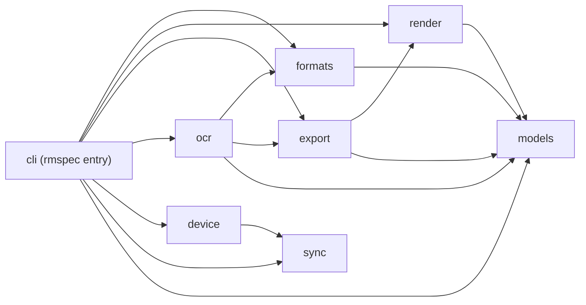

# remarkable-spec · System overview

## What it does

`remarkable-spec` is one Python distribution (`pyproject.toml:2`), built as a single src-layout
package (`pyproject.toml:55-57`), that turns a reMarkable Paper Pro tablet into a scriptable surface.
It parses the tablet's v6 `.rm` binary stroke files, re-renders handwritten pages as SVG, PNG, or
PDF, transcribes handwriting, extracts Mermaid source from hand-drawn diagrams, and moves files to
and from the device over USB/SSH
(`README.md:3`). Its intended operator is not a person at a prompt but a terminal-based AI coding
agent: the command surface, the structured `--json` output, and the OCR step that calls Opus 4.6 via
Bedrock all assume an LLM is sequencing the commands and interpreting the results (`README.md:5`).
The round trip that motivates the design is push, annotate, read back — an agent sends a Markdown
document to the tablet, a person marks it up with a pen, and the agent reads those marks back as
structured text and applies them to the source file (`README.md:51-70`). Hardware support is narrow
and declared as such: Paper Pro at 1620x2160 and 229 DPI is the tested target, and other reMarkable
models are untested (`README.md:9-12`).

Eight packages sit under `src/remarkable_spec/`, and the code currently imports in one direction with
no cycles. `models` is the shared vocabulary and a leaf: Pydantic v2 types for strokes, pages,
documents, pens, colors, and screens, including the `PenColor` integer enum's 14 members numbered 0
through 13 (`src/remarkable_spec/models/color.py:17-41`, 119 LOC) and the two `ScreenSpec` constants
that `detect_screen` chooses between by inspecting stroke coordinate extents
(`src/remarkable_spec/models/screen.py:80-104`, 104 LOC). `formats` wraps the third-party `rmscene`
parser and maps its scene tree onto those models (`src/remarkable_spec/formats/rm_file.py:1-13`,
212 LOC). `render` holds the SVG engine plus per-pen geometry — `get_pen_renderer` dispatches across
10 pen families and falls back to fineliner for anything unrecognized
(`src/remarkable_spec/render/pens.py:457-480`, 480 LOC) — and compensates for the v6
format's center-origin X axis with `x_shift = vw / 2` (`src/remarkable_spec/render/engine.py:134`).
`export` layers file writers over `render` (`src/remarkable_spec/export/pdf.py:16`, 168 LOC). `ocr`
orchestrates transcription, and the split matters: its `pipeline.py` is straight-line
(`src/remarkable_spec/ocr/pipeline.py:113-127`, 127 LOC), while the only concurrency anywhere in the
codebase is the two-worker thread pool that runs Apple Vision and AWS Textract side by side inside
`postprocess.py` (`src/remarkable_spec/ocr/postprocess.py:131`, 235 LOC). `sync` is the other leaf —
a stdlib `sqlite3` store in WAL mode over six hand-written tables
(`src/remarkable_spec/sync/db.py:52-55`, 365 LOC; `src/remarkable_spec/sync/migrations.py:17-93`,
151 LOC) whose OCR and diagram caches key on the SHA-256 of the `.rm` file
(`src/remarkable_spec/sync/models.py:72`, 120 LOC). `device` reaches the tablet over SSH through a
lazily imported paramiko (`src/remarkable_spec/device/connection.py:25-35`, 231 LOC) and records what
it moved into `sync` (`src/remarkable_spec/device/sync.py:28`, 573 LOC). `cli` is the only package
that reaches all seven others.

Two surfaces are public. The console script `rmspec` mounts 11 top-level commands onto one
`cyclopts.App` (`pyproject.toml:20-21`, `src/remarkable_spec/cli/__init__.py:48-58`) and reads its
defaults from `RMSPEC_`-prefixed environment variables
(`src/remarkable_spec/cli/_util.py:22-27`, 112 LOC). Imported as a library instead, the root module
re-exports 26 names, every one of them from `models`
(`src/remarkable_spec/__init__.py:33-67`, 67 LOC).

## Stack

| Layer | Technology | Source |
| --- | --- | --- |
| Language floor | Python, `requires-python = ">=3.12"` | `pyproject.toml:10` |
| Interpreter pin | `3.13` — one minor ahead of the lint and type-check target `py312` | `.python-version:1`, `pyproject.toml:60` |
| CLI framework | `cyclopts>=3.0.0`, mounted as `cyclopts.App` | `pyproject.toml:14`, `src/remarkable_spec/cli/__init__.py:40` |
| Data modeling | `pydantic>=2.10.0` and `pydantic-settings>=2.13.1` | `pyproject.toml:12`, `pyproject.toml:16` |
| Binary `.rm` parser | `rmscene>=0.7.0,<0.8.0` — the only upper-bounded pin | `pyproject.toml:13` |
| Terminal output | `rich>=13.0.0` | `pyproject.toml:15` |
| PDF rasterization | `pymupdf>=1.24.0`, for compositing PDF backgrounds under strokes | `pyproject.toml:17` |
| Local storage | Stdlib `sqlite3` with hand-written SQL, no ORM | `src/remarkable_spec/sync/db.py:11`, `src/remarkable_spec/sync/migrations.py:17` |
| Raster export extra | `[render]` — `cairocffi`, `cairosvg`, `pillow` | `pyproject.toml:24-28` |
| Device transport extra | `[device]` — `paramiko`, `httpx` | `pyproject.toml:29-32` |
| Handwriting OCR extra | `[ocr]` — `pyobjc-framework-quartz`, `pyobjc-framework-vision` (macOS only) | `pyproject.toml:43-46` |
| Cloud OCR and LLM extra | `[aws]` — `boto3>=1.42.59`, for Textract and Bedrock | `pyproject.toml:37-39` |
| Markdown push extra | `[push]` — `weasyprint`, `markdown` | `pyproject.toml:33-36` |
| External optional binary | `mmdc` (mermaid-cli), shelled out to for Mermaid rendering | `src/remarkable_spec/ocr/diagram.py:232`, `src/remarkable_spec/cli/diagram_cmd.py:289` |
| Build backend | `uv_build>=0.10.7,<0.11.0` over a `src/` layout | `pyproject.toml:55-57` |
| Lint and format | `ruff`, selection `E, F, I, N, UP, B, SIM, RUF`, line length 99 | `pyproject.toml:59-68` |
| Type checking | `[tool.pyright]` is configured, while the task runner invokes `ty` | `pyproject.toml:70-72`, `mise.toml:12` |
| Task runner | `mise` tasks; `check` depends on lint, format, typecheck | `mise.toml:7-13` |
| Test harness | `pytest` is configured with `testpaths = ["tests"]`; the `tests` directory holds one 0-byte `__init__.py` and no test module | `pyproject.toml:74-76`, `mise.toml:9` |
| Git hooks | `lefthook` — ruff on staged Python at pre-commit, Conventional Commits at commit-msg | `lefthook.yml:1-11`, `lefthook.yml:13-24` |

## Module map

Nodes are the eight package directories under `src/remarkable_spec/`. Each edge is one or more
`from remarkable_spec.<module>` import confirmed at a call site; edge direction is importer to
imported.

`cli` is the only module with an edge to every other, confirmed at seven import sites:
`formats`, `models`, `ocr`, and `render` at `src/remarkable_spec/cli/annotations_cmd.py:222-225`
(299 LOC), `device` at `src/remarkable_spec/cli/device_cmd.py:109` (504 LOC), `export` at
`src/remarkable_spec/cli/render_cmd.py:357` (408 LOC), and `sync` at
`src/remarkable_spec/cli/_util.py:80` (112 LOC). `models` and `sync` have no outbound internal edges.
Nothing in the repository enforces this layering: the ruff selection carries no import-boundary rule
(`pyproject.toml:63-68`) and the task runner's `check` gate is lint, format, and typecheck only
(`mise.toml:13`). Treat the direction above as what the code currently does, not as a gate.

## See also

- [tech debt](../insights/tech-debt.md) — 23 shared source citations
- [contract map](../insights/contract-map.md) — 22 shared source citations
- [business logic](../insights/business-logic.md) — 21 shared source citations
- [impact analysis](../insights/impact-analysis.md) — 21 shared source citations
- [dependency graph](../diagrams/structural/dependency-graph.md) — 20 shared source citations
