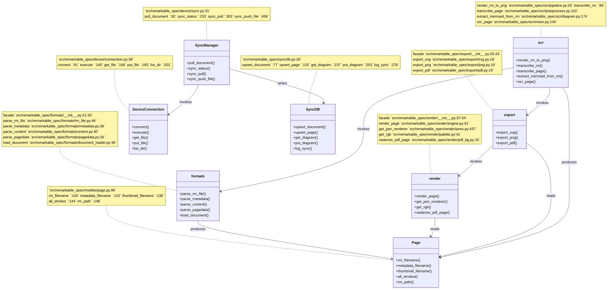

# remarkable-spec · Components

## See also

- [module map](../../architecture/module-map.md) — 23 shared source citations
- [contract map](../../insights/contract-map.md) — 21 shared source citations
- [impact analysis](../../insights/impact-analysis.md) — 19 shared source citations
- [business logic](../../insights/business-logic.md) — 17 shared source citations
- [processes](../../behavior/processes.md) — 15 shared source citations
