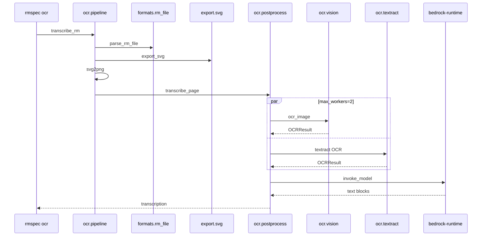
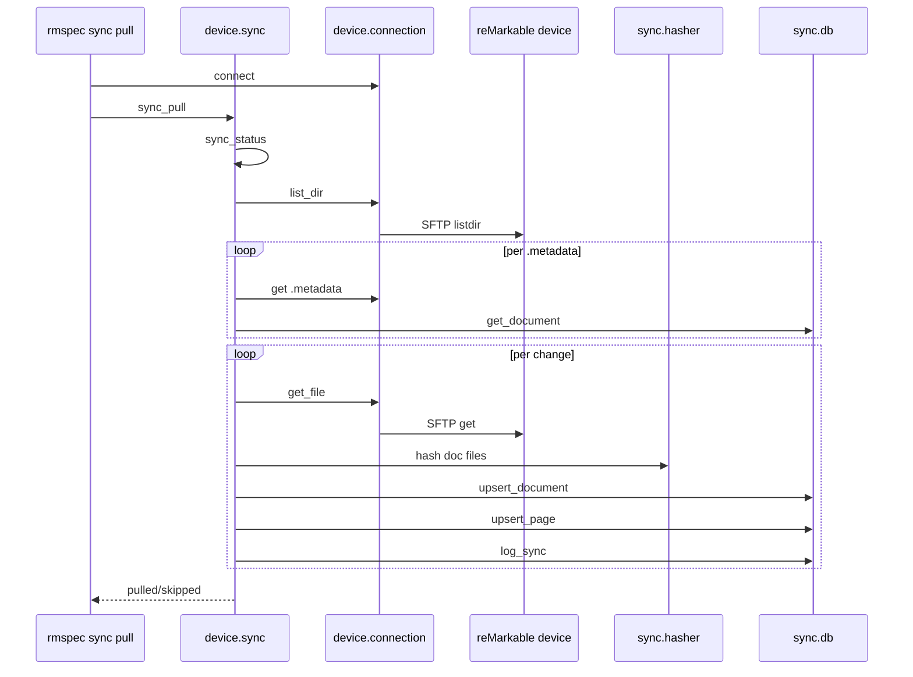
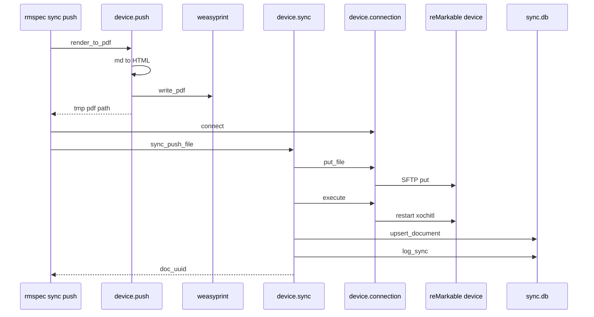

# remarkable-spec · Sequences

Diagrams at a glance for the three deepest multi-participant flows. Each process gets one
`sequenceDiagram` drawn in outbound dispatch order: solid arrows are synchronous calls, dashed arrows
are returns. Every diagram is capped at 20 elements, so intermediate returns and secondary calls are
omitted from the drawing; the tables under each diagram carry the full call-site citations, and a
trailing note names what was left out.

## rmspec ocr — handwriting transcription

### Participants

| Label | Traces to |
| --- | --- |
| `rmspec ocr` | the `@app.default` handler `ocr` at `src/remarkable_spec/cli/ocr_cmd.py:50`, registered on the `cyclopts.App` at `:45` |
| `ocr.pipeline` | `src/remarkable_spec/ocr/pipeline.py` — `transcribe_rm` at `:86`, `render_rm_to_png` at `:25` |
| `formats.rm_file` | `src/remarkable_spec/formats/rm_file.py` — `parse_rm_file` at `:46` |
| `export.svg` | `src/remarkable_spec/export/svg.py` — `export_svg` at `:18` |
| `ocr.postprocess` | `src/remarkable_spec/ocr/postprocess.py` — `transcribe_page` at `:110`, `merge_with_image` at `:148` |
| `ocr.vision` | `src/remarkable_spec/ocr/vision.py` — `ocr_image` at `:63`, backed by `VNRecognizeTextRequest` at `:89` |
| `ocr.textract` | `src/remarkable_spec/ocr/textract.py` — `ocr_image_textract` at `:23`, AWS client at `:37` |
| `bedrock-runtime` | the boto3 client name literal at `src/remarkable_spec/ocr/postprocess.py:200` |

### Edge call sites

| # | Edge | Call site |
| --- | --- | --- |
| 1 | `transcribe_rm` | called at `src/remarkable_spec/cli/ocr_cmd.py:96` for a direct `.rm` argument and at `:155` for a resolved document page |
| 2 | `parse_rm_file` | `src/remarkable_spec/ocr/pipeline.py:58`, inside `render_rm_to_png`, which `transcribe_rm` invokes at `:115` |
| 3 | `export_svg` | `src/remarkable_spec/ocr/pipeline.py:66` |
| 4 | `svg2png` | `src/remarkable_spec/ocr/pipeline.py:75`; `cairosvg` is lazily imported at `:52`, and the intermediate `.svg` is unlinked at `:82` |
| 5 | `transcribe_page` | `src/remarkable_spec/ocr/pipeline.py:123` |
| 6 | `ocr_image` | submitted to the pool at `src/remarkable_spec/ocr/postprocess.py:132`; the pool is `ThreadPoolExecutor(max_workers=2)` at `:131` — the only concurrency site in the codebase |
| 7 | `OCRResult` (Vision) | resolved at `src/remarkable_spec/ocr/postprocess.py:135`; the dataclass is declared at `src/remarkable_spec/ocr/vision.py:19` |
| 8 | `textract OCR` | `ocr_image_textract` submitted at `src/remarkable_spec/ocr/postprocess.py:133`; it calls `detect_document_text` at `src/remarkable_spec/ocr/textract.py:40` |
| 9 | `OCRResult` (Textract) | resolved at `src/remarkable_spec/ocr/postprocess.py:136`; assembled from `LINE` blocks at `src/remarkable_spec/ocr/textract.py:46-71` |
| 10 | `invoke_model` | `src/remarkable_spec/ocr/postprocess.py:228`, reached via `merge_with_image` at `:139` and `_invoke_bedrock_vision` at `:178`; the request body sets `anthropic_version` at `:204`, not the `converse` API |
| 11 | `text blocks` | response parsed at `src/remarkable_spec/ocr/postprocess.py:229`; the last text block is extracted at `:232-234` because extended thinking is enabled at `:207` |
| 12 | `transcription` | returned at `src/remarkable_spec/ocr/postprocess.py:145`, passed back through `src/remarkable_spec/ocr/pipeline.py:123`, and printed at `src/remarkable_spec/cli/ocr_cmd.py:100` |

## rmspec sync pull — incremental device pull

### Participants

| Label | Traces to |
| --- | --- |
| `rmspec sync pull` | the `@app.command` handler `pull` at `src/remarkable_spec/cli/sync_cmd.py:171` |
| `device.sync` | `src/remarkable_spec/device/sync.py` — `SyncManager` at `:31`, `sync_pull` at `:303` |
| `device.connection` | `src/remarkable_spec/device/connection.py` — `DeviceConnection` at `:38`, wrapping paramiko SSH plus SFTP |
| `reMarkable device` | the SSH/SFTP peer at `RmspecSettings.device_host`, default `10.11.99.1` (`src/remarkable_spec/cli/_util.py:34-38`) |
| `sync.hasher` | `src/remarkable_spec/sync/hasher.py` — `hash_document_files` at `:27`, `hash_file` at `:15` |
| `sync.db` | `src/remarkable_spec/sync/db.py` — `SyncDB` at `:26`, over stdlib `sqlite3` |

### Edge call sites

| # | Edge | Call site |
| --- | --- | --- |
| 1 | `connect` | context-manager entry at `src/remarkable_spec/cli/sync_cmd.py:204`, built by `_get_connection` at `:81-94`; `__enter__` calls `connect` at `src/remarkable_spec/device/connection.py:221`, defined at `:81` |
| 2 | `sync_pull` | `src/remarkable_spec/cli/sync_cmd.py:206` |
| 3 | `sync_status` | self-call at `src/remarkable_spec/device/sync.py:328`; the method is defined at `:233` and returns `(uuid, name, change_type)` triples |
| 4 | `list_dir` | `src/remarkable_spec/device/sync.py:260`, over the constant `XOCHITL_DIR` set at `:48` from `src/remarkable_spec/device/paths.py:35` |
| 5 | `SFTP listdir` | `src/remarkable_spec/device/connection.py:217`, inside `list_dir` at `:202` |
| 6 | `get .metadata` | `src/remarkable_spec/device/sync.py:274` into a temp file created at `:271`; the JSON is parsed at `:275` and a fetch failure is swallowed by the bare `except Exception: continue` at `:276-277` |
| 7 | `get_document` | `src/remarkable_spec/device/sync.py:288`, defined at `src/remarkable_spec/sync/db.py:111`; absence means `new_on_device` (`src/remarkable_spec/device/sync.py:290`), a newer device timestamp means `modified_on_device` (`:291-292`) |
| 8 | `get_file` | `pull_document` invoked at `src/remarkable_spec/device/sync.py:339` and defined at `:92`; it calls `connection.get_file` at `:116` for sidecars, `:128` for the page directory, and `:142` for thumbnails |
| 9 | `SFTP get` | `src/remarkable_spec/device/connection.py:181`, inside `get_file` at `:166` |
| 10 | `hash doc files` | `src/remarkable_spec/device/sync.py:342`, defined at `src/remarkable_spec/sync/hasher.py:27`; the per-page `rm_hash` is computed separately at `src/remarkable_spec/device/sync.py:393` |
| 11 | `upsert_document` | `src/remarkable_spec/device/sync.py:384` with the record built at `:372-383`, defined at `src/remarkable_spec/sync/db.py:77` |
| 12 | `upsert_page` | `src/remarkable_spec/device/sync.py:397` once per page UUID from the loop at `:388`, defined at `src/remarkable_spec/sync/db.py:132` |
| 13 | `log_sync` | `src/remarkable_spec/device/sync.py:408` on success and `:423` on failure, defined at `src/remarkable_spec/sync/db.py:278` |
| 14 | `pulled/skipped` | returned at `src/remarkable_spec/device/sync.py:435` and reported at `src/remarkable_spec/cli/sync_cmd.py:215-224` |

Not drawn, for element budget: the `deleted_on_device` branch calls `delete_document` at
`src/remarkable_spec/device/sync.py:334` (`src/remarkable_spec/sync/db.py:125`), and the
per-document `except Exception` at `src/remarkable_spec/device/sync.py:420` routes the document to
the skipped list at `:432`.

## rmspec sync push — Markdown render and upload

### Participants

| Label | Traces to |
| --- | --- |
| `rmspec sync push` | the `@app.command` handler `push` at `src/remarkable_spec/cli/sync_cmd.py:228`; `rmspec device push` at `src/remarkable_spec/cli/device_cmd.py:443` delegates to this same function at `:494-504` |
| `device.push` | `src/remarkable_spec/device/push.py` — `render_to_pdf` at `:30`, `_render_markdown` at `:58` |
| `weasyprint` | the PDF writer called at `src/remarkable_spec/device/push.py:112`, imported at `:67` behind the `[push]` extra |
| `device.sync` | `src/remarkable_spec/device/sync.py` — `sync_push_file` at `:456` |
| `device.connection` | `src/remarkable_spec/device/connection.py` — `put_file` at `:183`, `execute` at `:140` |
| `reMarkable device` | the SSH/SFTP peer at `RmspecSettings.device_host` (`src/remarkable_spec/cli/_util.py:34-38`) |
| `sync.db` | `src/remarkable_spec/sync/db.py` — `SyncDB` at `:26` |

### Edge call sites

| # | Edge | Call site |
| --- | --- | --- |
| 1 | `render_to_pdf` | `src/remarkable_spec/cli/sync_cmd.py:339`, taken only for the renderable suffixes listed at `:319`; defined at `src/remarkable_spec/device/push.py:30` |
| 2 | `md to HTML` | `markdown.markdown` with the `tables`, `fenced_code`, and `codehilite` extensions at `src/remarkable_spec/device/push.py:75`, reached through the `_RENDERERS` table lookup at `:49` and the call at `:55`; the table maps `.md` to `_render_markdown` at `:189-193` |
| 3 | `write_pdf` | `weasyprint.HTML(string=html).write_pdf(...)` at `src/remarkable_spec/device/push.py:112`, writing to the `mkstemp` path created at `:109-111` |
| 4 | `tmp pdf path` | returned at `src/remarkable_spec/device/push.py:113` through `:55` to `src/remarkable_spec/cli/sync_cmd.py:339`; after upload it is moved into the user cache at `:357-364` |
| 5 | `connect` | context-manager entry at `src/remarkable_spec/cli/sync_cmd.py:345` |
| 6 | `sync_push_file` | `src/remarkable_spec/cli/sync_cmd.py:347`, defined at `src/remarkable_spec/device/sync.py:456`; it rejects any suffix other than `.pdf` or `.epub` at `:485-486`, which is why step 1 runs first |
| 7 | `put_file` | `src/remarkable_spec/device/sync.py:526` for the PDF itself, then `:546-547` for the generated `.metadata` and `.content` sidecars built at `:499-523` |
| 8 | `SFTP put` | `src/remarkable_spec/device/connection.py:200`, inside `put_file` at `:183` |
| 9 | `execute` | `src/remarkable_spec/device/sync.py:530` creates the per-document page directory, and `:532` touches one empty `.rm` stub per generated page UUID from `:515`; `execute` runs `exec_command` at `src/remarkable_spec/device/connection.py:156` |
| 10 | `restart xochitl` | `src/remarkable_spec/device/sync.py:552` — `systemctl restart xochitl`, required for the device UI to pick the document up |
| 11 | `upsert_document` | `src/remarkable_spec/device/sync.py:555`, defined at `src/remarkable_spec/sync/db.py:77` |
| 12 | `log_sync` | `src/remarkable_spec/device/sync.py:563` with `direction="push"`, defined at `src/remarkable_spec/sync/db.py:278` |
| 13 | `doc_uuid` | the UUID minted at `src/remarkable_spec/device/sync.py:489` and returned at `:573`, reported at `src/remarkable_spec/cli/sync_cmd.py:354` |

Not drawn, for element budget: the optional `--folder` name lookup issues an HTTP call through
`WebAPI.list_all_documents` at `src/remarkable_spec/cli/sync_cmd.py:291`
(`src/remarkable_spec/device/web_api.py:90`), and `_count_pdf_pages` at
`src/remarkable_spec/device/sync.py:497` (defined at `:438`) reads the page count with PyMuPDF before
the page UUIDs are generated.

The `.md` branch drawn above performs no Mermaid rendering. The `mmdc` binary is reached only from
`_render_mermaid` at `src/remarkable_spec/device/push.py:129`, which is the `.mmd` branch of the same
`_RENDERERS` table at `:191` and emits a PDF directly via `--pdfFit`.

## See also

- [contract map](../../insights/contract-map.md) — 17 shared source citations
- [processes](../../behavior/processes.md) — 16 shared source citations
- [business logic](../../insights/business-logic.md) — 16 shared source citations
- [module map](../../architecture/module-map.md) — 14 shared source citations
- [data flow](../../architecture/data-flow.md) — 13 shared source citations
