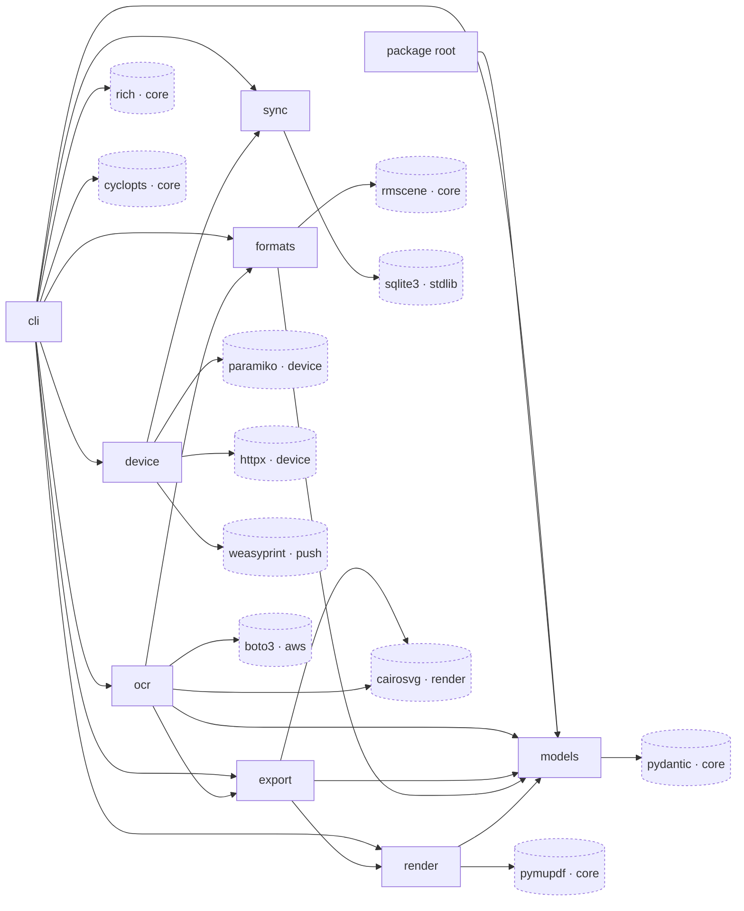

# remarkable-spec · Dependency graph

One distribution, `remarkable-spec` (`pyproject.toml:2`), built src-layout by the `uv_build` backend
(`pyproject.toml:55-57`). Its internals are the eight packages under `src/remarkable_spec/` plus the
root `__init__.py`, which is a re-export facade importing from `models` and nothing else
(`src/remarkable_spec/__init__.py:6`). Its externals split into **six core runtime dependencies**
(`pyproject.toml:11-18`) and **five functional optional extras** — `render`, `device`, `push`, `aws`,
`ocr` — plus an `all` aggregate whose whole content is the other five (`pyproject.toml:23-46`, at
`pyproject.toml:41`). Every external node below carries its tier in the label, because that split is
what determines whether an import can fail at runtime.

The interesting consequence of the extras split is visible in the import sites themselves: the edges
reaching extras-backed code are function-local, not module-level, so `rmspec` starts without cairo,
paramiko, httpx, weasyprint, or boto3 installed and fails only inside the command that needs one.
`src/remarkable_spec/device/connection.py:28` and `src/remarkable_spec/device/web_api.py:27` are the
pattern — a `_import_paramiko` / `_import_httpx` helper that converts `ImportError` into an
install hint. The `## Internal edges` table below marks which edges are deferred this way.

The direction shown is measured from import statements as the code stands. **Nothing enforces it** —
there is no import-linter, no dependency-cruiser, and no architecture test; `pyproject.toml:59-72`
configures only ruff and pyright, and `pyproject.toml:63-68` selects no layering rule. Read the arrows
as "the code currently imports this way", not as a gate.

## Legend (overflow)

Twenty nodes is the budget and the graph is at it, so seven external candidates were elided. Edge
count is the number of import sites in `src/` (for `mmdc`, `subprocess.run` invocation sites).

| Elided node | Tier | Edges | Would attach to | Evidence |
| --- | --- | --- | --- | --- |
| `mmdc` (mermaid-cli) | external binary, declared in no manifest | 3 | `ocr`, `cli`, `device` | `src/remarkable_spec/ocr/diagram.py:232`, `src/remarkable_spec/cli/diagram_cmd.py:289`, `src/remarkable_spec/device/push.py:129` |
| `pydantic-settings` | core, `pyproject.toml:16` | 1 | `cli` | `src/remarkable_spec/cli/_util.py:10` |
| `cairocffi` | `[render]`, `pyproject.toml:25` | 1 | `export` | `src/remarkable_spec/export/pdf.py:59` |
| `markdown` | `[push]`, `pyproject.toml:35` | 1 | `device` | `src/remarkable_spec/device/push.py:66` |
| `pyobjc-framework-vision` | `[ocr]`, `pyproject.toml:45` | 1 | `ocr` | `src/remarkable_spec/ocr/vision.py:42` (imported as `Vision`) |
| `pyobjc-framework-quartz` | `[ocr]`, `pyproject.toml:44` | 1 | `ocr` | `src/remarkable_spec/ocr/vision.py:54` (imported as `Quartz`) |
| `pillow` | `[render]`, `pyproject.toml:27` | **0** | nothing | Declared and advertised (`README.md:128`) but imported nowhere; only three docstring mentions, at `src/remarkable_spec/export/png.py:6`, `:32`, `:51` |

`mmdc` is the elision that costs the most: it is a real runtime dependency of three code paths and it
appears in no manifest, so `uv sync --all-extras` does not install it. `README.md:132-133` lists it
under "External tools (optional)". All three call sites catch its absence and degrade rather than
crash — `src/remarkable_spec/cli/diagram_cmd.py:299-303` and `src/remarkable_spec/device/push.py:134-138`
convert `FileNotFoundError` into an `npm install -g @mermaid-js/mermaid-cli` hint, and
`src/remarkable_spec/ocr/diagram.py:241-255` falls back to checking the Mermaid source against a list
of known diagram-type keywords.

`pillow` is the opposite case — an edge count of 0 is why it lost its slot. The docstring at
`src/remarkable_spec/export/png.py:32` promises "either `cairosvg` or `pillow`", but the runtime path
at `src/remarkable_spec/export/png.py:88-112` tries `cairosvg` and then raises an `ImportError`
naming only cairosvg. No pillow fallback exists to draw an edge for.

## Internal nodes

| Node | Path | Outbound internal edges | Representative import site |
| --- | --- | --- | --- |
| `cli` | `src/remarkable_spec/cli/` | 7 — reaches every other package | `src/remarkable_spec/cli/inspect_cmd.py:39` |
| `ocr` | `src/remarkable_spec/ocr/` | 3 | `src/remarkable_spec/ocr/pipeline.py:47` |
| `export` | `src/remarkable_spec/export/` | 2 | `src/remarkable_spec/export/pdf.py:16` |
| `formats` | `src/remarkable_spec/formats/` | 1 | `src/remarkable_spec/formats/content.py:32` |
| `render` | `src/remarkable_spec/render/` | 1 | `src/remarkable_spec/render/engine.py:21` |
| `device` | `src/remarkable_spec/device/` | 1 | `src/remarkable_spec/device/sync.py:28` |
| `package root` | `src/remarkable_spec/__init__.py` | 1 | `src/remarkable_spec/__init__.py:6` |
| `models` | `src/remarkable_spec/models/` | 0 — leaf | no outbound internal import; pydantic is its only third-party import, as at `src/remarkable_spec/models/page.py:13` |
| `sync` | `src/remarkable_spec/sync/` | 0 — leaf | no outbound internal import; its third-party surface is pydantic (`src/remarkable_spec/sync/models.py:11`) plus stdlib `sqlite3` (`src/remarkable_spec/sync/db.py:11`) |

`cli` is the only node that reaches every other package — 7 of the 8 other internal nodes, the
exception being the root facade, which nothing imports from inside the package. The graph is acyclic:
`models` and `sync` sink every path.

## Internal edges

Weight is the number of `from remarkable_spec.<target>` import statements in the source package.
"Deferred" counts those written inside a function body rather than at module level — the mechanism
that keeps optional extras out of `rmspec` startup.

| Edge | Weight | Deferred | Import site |
| --- | --- | --- | --- |
| `cli` → `models` | 15 | 10 of 15 | `src/remarkable_spec/cli/inspect_cmd.py:39` (module level), `src/remarkable_spec/cli/annotations_cmd.py:223` (deferred) |
| `cli` → `formats` | 13 | 9 of 13 | `src/remarkable_spec/cli/ls_cmd.py:48` (module level), `src/remarkable_spec/cli/annotations_cmd.py:222` (deferred) |
| `cli` → `device` | 11 | all 11 | `src/remarkable_spec/cli/device_cmd.py:109` |
| `formats` → `models` | 8 | none | `src/remarkable_spec/formats/content.py:32` |
| `cli` → `ocr` | 8 | all 8 | `src/remarkable_spec/cli/annotations_cmd.py:224` |
| `root` → `models` | 7 | none | `src/remarkable_spec/__init__.py:6` |
| `export` → `models` | 6 | none | `src/remarkable_spec/export/pdf.py:14` |
| `render` → `models` | 6 | none | `src/remarkable_spec/render/engine.py:21` |
| `cli` → `sync` | 5 | all 5 | `src/remarkable_spec/cli/_util.py:80` |
| `cli` → `render` | 5 | all 5 | `src/remarkable_spec/cli/annotations_cmd.py:225` |
| `export` → `render` | 4 | none | `src/remarkable_spec/export/pdf.py:16` |
| `device` → `sync` | 4 | all 4 | `src/remarkable_spec/device/sync.py:28` |
| `ocr` → `models` | 4 | all 4 | `src/remarkable_spec/ocr/pipeline.py:48` |
| `cli` → `export` | 3 | all 3 | `src/remarkable_spec/cli/render_cmd.py:357` |
| `ocr` → `formats` | 2 | all 2 | `src/remarkable_spec/ocr/pipeline.py:47` |
| `ocr` → `export` | 2 | all 2 | `src/remarkable_spec/ocr/pipeline.py:46` |

Every edge out of `device` and `ocr`, and five of the seven out of `cli`, are wholly deferred. The
edges with no deferred component at all are the five leaving `formats`, `render`, `export`, and the
root — all of which target `models` or `render`, the two packages whose own imports never reach an
optional extra.

## External edges

Source module is the package holding the most import sites for that dependency; where that was a tie,
the tie-break is stated. Counts are import sites across `src/`.

| Edge | Tier | Sites | Import site |
| --- | --- | --- | --- |
| `cli` → `rich` | core, `pyproject.toml:15` | 27, all in `cli` | `src/remarkable_spec/cli/_resolve.py:18` |
| `cli` → `cyclopts` | core, `pyproject.toml:14` | 12, all in `cli` | `src/remarkable_spec/cli/__init__.py:23` |
| `models` → `pydantic` | core, `pyproject.toml:12` | 9 total, 7 in `models` | `src/remarkable_spec/models/page.py:13`; the other two are `src/remarkable_spec/cli/_util.py:9` and `src/remarkable_spec/sync/models.py:11` |
| `ocr` → `boto3` | `[aws]`, `pyproject.toml:38` | 4 total, 3 in `ocr` | `src/remarkable_spec/ocr/textract.py:16`, `src/remarkable_spec/ocr/postprocess.py:196`, `src/remarkable_spec/ocr/diagram.py:298`; fourth is `src/remarkable_spec/cli/annotations_cmd.py:261` |
| `export` → `cairosvg` | `[render]`, `pyproject.toml:26` | 4 total, 2 in `export` | `src/remarkable_spec/export/pdf.py:67`, `src/remarkable_spec/export/png.py:90` |
| `ocr` → `cairosvg` | `[render]`, `pyproject.toml:26` | 4 total, 2 in `ocr` — tied with `export`, so both edges are drawn | `src/remarkable_spec/ocr/pipeline.py:52`, `src/remarkable_spec/ocr/vision.py:176` |
| `render` → `pymupdf` | core, `pyproject.toml:17` | 3, split 1/1/1 across `render`, `cli`, `device` — tie broken toward the only module-level import | `src/remarkable_spec/render/pdf_bg.py:12` (module level); deferred elsewhere at `src/remarkable_spec/cli/annotations_cmd.py:130` and `src/remarkable_spec/device/sync.py:441` |
| `device` → `paramiko` | `[device]`, `pyproject.toml:30` | 3 total, 2 in `device` | `src/remarkable_spec/device/connection.py:28`; the type-only import is `src/remarkable_spec/device/connection.py:22` under `TYPE_CHECKING` |
| `device` → `httpx` | `[device]`, `pyproject.toml:31` | 3 total, 2 in `device` | `src/remarkable_spec/device/web_api.py:27`; type-only at `src/remarkable_spec/device/web_api.py:21` |
| `formats` → `rmscene` | core, `pyproject.toml:13` | 2, all in `formats` | `src/remarkable_spec/formats/rm_file.py:21` |
| `sync` → `sqlite3` | stdlib, in no manifest | 2, all in `sync` | `src/remarkable_spec/sync/db.py:11`, `src/remarkable_spec/sync/migrations.py:10` |
| `device` → `weasyprint` | `[push]`, `pyproject.toml:34` | 2, all in `device` | `src/remarkable_spec/device/push.py:67` |

`rmscene` is the only upper-bounded pin among the runtime dependencies and extras —
`>=0.7.0,<0.8.0` at `pyproject.toml:13` — while every other one declares a floor and no ceiling. The
build backend at `pyproject.toml:56` is the file's only other bounded requirement, and it is not a
runtime edge. The `sqlite3` node is deliberately labelled
`stdlib`: it is the system's only datastore and it costs nothing to install, which
`src/remarkable_spec/sync/db.py:6` states as the reason for the choice.

## What this graph does not show

- **No enforcement.** Re-stating it because it is the easiest thing to misread off a layered diagram:
  no tool checks these directions. `pyproject.toml:59-72` holds ruff and pyright configuration only,
  and the ruff selection at `pyproject.toml:63-68` includes no import-boundary rule.
- **Nodes that are services, not libraries.** `boto3` is drawn, but the two AWS services behind it are
  not: `src/remarkable_spec/ocr/textract.py:37` opens a `textract` client and
  `src/remarkable_spec/ocr/postprocess.py:200`, `src/remarkable_spec/ocr/diagram.py:304`, and
  `src/remarkable_spec/cli/annotations_cmd.py:272` each open a `bedrock-runtime` client. Reaching
  those is billable.
- **The reMarkable device itself.** The `device` package talks to hardware over SSH and HTTP through
  `paramiko` and `httpx`; the device is the far end of those two edges, not a node.
- **Native libraries under the Python packages.** `cairosvg` and `cairocffi` need `libcairo`, and the
  `[ocr]` pyobjc packages bind macOS-only frameworks at `src/remarkable_spec/ocr/vision.py:42` and
  `:54`. `README.md:134` records the cairo path expectation.
- **Test-side dependencies.** There are none to draw: the `dev` group at `pyproject.toml:49-53`
  installs pytest, ruff, and pyright, but no test module imports anything — `tests/` holds one
  0-byte `tests/__init__.py`.

## See also

- [contract map](../../insights/contract-map.md) — 30 shared source citations
- [processes](../../behavior/processes.md) — 28 shared source citations
- [business logic](../../insights/business-logic.md) — 28 shared source citations
- [tech debt](../../insights/tech-debt.md) — 26 shared source citations
- [module map](../../architecture/module-map.md) — 25 shared source citations
